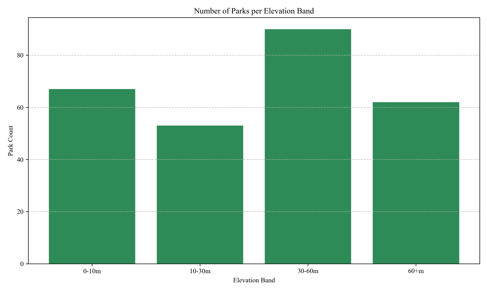

# 🌲 Vancouver Parks and Elevation Analysis

This project analyzes the spatial relationship between **parks** and **elevation zones** in Vancouver, BC using Python, GeoPandas, and open data.

---

## 🎯 Goal

- Classify the city's terrain into elevation bands using 2-meter contour lines
- Overlay public park polygons and identify which elevation zones they fall into
- Visualize the spatial data with maps and charts
- Count how many parks lie in each elevation band

---

## 🗂 Data Sources

Data was downloaded from the [City of Vancouver Open Data Portal](https://opendata.vancouver.ca):

- `elevation.geojson` — 2-meter elevation contours  
- `parks-polygon.geojson` — Park boundary polygons  
- `local-area-boundary.geojson` — Neighborhood boundary polygons

---

## 🛠 Tools Used

- Python
- GeoPandas
- Matplotlib
- Contextily (for basemaps)
- Pandas

---

## 📊 Outputs

### 🗺️ Elevation and Park Map  
Color-coded elevation zones + parks + neighborhoods:


---

### 📈 Bar Chart – Number of Parks per Elevation Band



---

## ▶️ How to Run

1. Clone this repository and place the required `.geojson` files in the same directory.
2. Run the script:

```bash
python vancouver_parks_elevation.py


